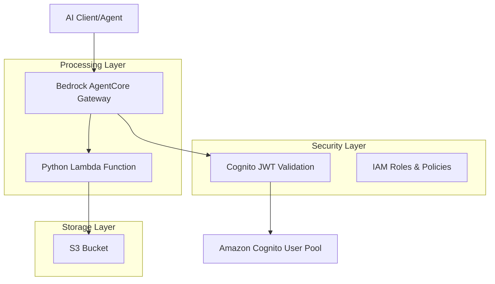

# Design Document

## Overview

This system implements a secure, scalable gateway to Amazon Bedrock AgentCore that provides CRUD operations on S3 buckets through a Python Lambda function. The architecture leverages AWS managed services to create a production-ready solution with JWT authentication via Amazon Cognito, exposing standardized MCP (Model Context Protocol) actions for client interactions.

The solution addresses the enterprise need for secure, authenticated access to S3 storage operations through AI agents while maintaining proper access controls, audit trails, and scalability. By using Bedrock AgentCore Gateway as the central orchestration point, the system provides a standardized interface that can be easily integrated with various AI applications and development tools.

## Architecture

The system follows a layered architecture pattern with clear separation of concerns:



### Key Architectural Principles

1. **Security First**: All communications use HTTPS/TLS, JWT tokens for authentication, and IAM roles for service-to-service authorization
2. **Serverless Design**: Leverages AWS managed services to minimize operational overhead
3. **Standardized Protocol**: Uses MCP for consistent tool integration across different AI platforms
4. **Infrastructure as Code**: Complete deployment through CloudFormation templates
5. **Least Privilege Access**: Each component has minimal required permissions

## Components and Interfaces

### 1. Amazon Bedrock AgentCore Gateway

**Purpose**: Central orchestration point that handles MCP protocol communication, authentication, and request routing.

**Key Responsibilities**:
- Validate JWT tokens against Cognito
- Expose MCP-compliant endpoints for tool discovery and invocation
- Route authenticated requests to the Lambda function
- Handle protocol translation between MCP and Lambda invocation
- Provide comprehensive logging and monitoring

**Configuration**:
- Inbound authorization: JWT with Cognito discovery URL
- Target configuration: Lambda function ARN
- MCP protocol support with tool discovery
- Request/response transformation

### 2. Amazon Cognito User Pool

**Purpose**: Identity provider for service-to-service OAuth authentication.

**Key Responsibilities**:
- Service authentication and credential management
- OAuth 2.0 client credentials flow for service-to-service authentication
- Access token generation with appropriate scopes
- Token validation for gateway requests
- Integration with OIDC discovery endpoints

**Configuration**:
- User pool with app client configured for client credentials flow
- OAuth 2.0 scopes for service authorization
- OIDC discovery URL for gateway integration
- Access token expiration policies
- Service-specific client credentials

### 3. Python Lambda Function

**Purpose**: Serverless compute service providing S3 CRUD operations.

**Key Responsibilities**:
- Process MCP tool invocation requests
- Perform S3 operations (Create, Read, Update, Delete)
- Input validation and error handling
- Response formatting for MCP protocol

**Interface Specification**:
```python
# Input Event Structure
{
    "operation": "create|read|update|delete",
    "bucket": "bucket-name",
    "key": "object-key",
    "content": "object-content",  # for create/update
    "metadata": {}  # optional metadata
}

# Response Structure
{
    "statusCode": 200|400|404|500,
    "body": {
        "success": true|false,
        "data": {},  # operation result
        "error": "error-message"  # if applicable
    }
}
```

### 4. S3 Bucket

**Purpose**: Object storage for CRUD operations.

**Configuration**:
- Bucket name provided as CloudFormation parameter
- Server-side encryption enabled
- Access logging for audit trails

## Data Models

### OAuth Access Token Structure
```json
{
  "sub": "service-client-id",
  "aud": "bedrock-gateway",
  "iss": "https://cognito-idp.region.amazonaws.com/user-pool-id",
  "exp": 1234567890,
  "iat": 1234567890,
  "token_use": "access",
  "scope": "s3:crud gateway:invoke",
  "client_id": "service-client-id",
  "grant_type": "client_credentials"
}
```

### MCP Tool Definitions
```json
{
  "tools": [
    {
      "name": "s3_create_object",
      "description": "Create a new object in the S3 bucket",
      "inputSchema": {
        "type": "object",
        "properties": {
          "key": {"type": "string"},
          "content": {"type": "string"},
          "metadata": {"type": "object"}
        },
        "required": ["key", "content"]
      }
    },
    {
      "name": "s3_read_object",
      "description": "Read an object from the S3 bucket",
      "inputSchema": {
        "type": "object",
        "properties": {
          "key": {"type": "string"}
        },
        "required": ["key"]
      }
    },
    {
      "name": "s3_update_object",
      "description": "Update an existing object in the S3 bucket",
      "inputSchema": {
        "type": "object",
        "properties": {
          "key": {"type": "string"},
          "content": {"type": "string"},
          "metadata": {"type": "object"}
        },
        "required": ["key", "content"]
      }
    },
    {
      "name": "s3_delete_object",
      "description": "Delete an object from the S3 bucket",
      "inputSchema": {
        "type": "object",
        "properties": {
          "key": {"type": "string"}
        },
        "required": ["key"]
      }
    }
  ]
}
```

### S3 Object Metadata
```json
{
  "key": "object-key",
  "size": 1024,
  "lastModified": "2024-12-11T10:00:00Z",
  "etag": "d41d8cd98f00b204e9800998ecf8427e",
  "contentType": "application/json",
  "metadata": {
    "created-by": "user-id",
    "operation": "create|update"
  }
}
```

## Correctness Properties

*A property is a characteristic or behavior that should hold true across all valid executions of a system-essentially, a formal statement about what the system should do. Properties serve as the bridge between human-readable specifications and machine-verifiable correctness guarantees.*

### Property Reflection

After analyzing all acceptance criteria, several properties can be consolidated to eliminate redundancy:

- Properties 4.1-4.5 (MCP action forwarding) can be combined into a single comprehensive property about request routing
- Properties 3.1-3.4 (individual CRUD operations) can be combined with their corresponding MCP forwarding properties
- Properties 2.2 and 2.4 (token validation and access) can be combined into a single authentication property

### Core Properties

**Property 1: Service authentication token validation**
*For any* valid OAuth access token issued via client credentials flow by the configured Cognito user pool, the Bedrock Gateway should validate the token and allow access to MCP actions
**Validates: Requirements 2.2, 2.4**

**Property 2: Service authentication failure handling**
*For any* invalid, expired, or malformed OAuth access token, the Bedrock Gateway should reject the request, return an authentication error, and log the failed attempt
**Validates: Requirements 2.3, 2.5**

**Property 3: CRUD operation round-trip consistency**
*For any* valid object key and content, creating an object then immediately reading it should return the same content that was stored
**Validates: Requirements 3.1, 3.2**

**Property 4: Update operation consistency**
*For any* existing object, updating it with new content then reading it should return the updated content
**Validates: Requirements 3.3, 3.2**

**Property 5: Delete operation effectiveness**
*For any* existing object, deleting it should result in subsequent read operations returning a "not found" error
**Validates: Requirements 3.4, 3.5**

**Property 6: MCP request routing consistency**
*For any* authenticated MCP action invocation, the gateway should forward the request to the Lambda function with proper formatting and return the Lambda response
**Validates: Requirements 4.1, 4.2, 4.3, 4.4, 4.5**

**Property 7: Error message specificity**
*For any* S3 operation failure (permissions, network, invalid input), the Lambda function should return error messages that accurately describe the failure type without exposing sensitive information
**Validates: Requirements 5.1, 5.2, 5.3, 5.5**

**Property 8: Input validation consistency**
*For any* invalid input to CRUD operations (empty keys, invalid characters, oversized content), the Lambda function should reject the input and return descriptive error messages
**Validates: Requirements 5.3**

**Property 9: Security event logging**
*For any* authentication attempt, authorization decision, or security-relevant error, the system should create appropriate log entries without exposing sensitive data in responses
**Validates: Requirements 2.5, 6.3, 6.5**

## Error Handling

### Authentication Errors
- **Invalid OAuth Token**: Return 401 Unauthorized with WWW-Authenticate header
- **Expired OAuth Token**: Return 401 Unauthorized with token refresh guidance using client credentials flow
- **Missing OAuth Token**: Return 401 Unauthorized with OAuth 2.0 authentication requirements
- **Insufficient Scope**: Return 403 Forbidden with required scope information

### Lambda Function Errors
- **S3 Access Denied**: Return 403 with sanitized permission error message
- **S3 Object Not Found**: Return 404 with clear object not found message
- **S3 Bucket Not Found**: Return 404 with bucket not found message
- **Invalid Input**: Return 400 with specific validation error details
- **Network Timeout**: Implement exponential backoff retry (3 attempts)
- **Unexpected Exceptions**: Log full error details, return 500 with generic message

### Gateway Errors
- **MCP Protocol Errors**: Return appropriate MCP error responses
- **Request Timeout**: Return 408 with timeout information
- **Rate Limiting**: Return 429 with retry-after header
- **Service Unavailable**: Return 503 with service status information

### Error Response Format
```json
{
  "error": {
    "code": "ERROR_CODE",
    "message": "Human-readable error description",
    "details": {
      "operation": "create|read|update|delete",
      "resource": "object-key-if-applicable"
    },
    "requestId": "unique-request-identifier"
  }
}
```

## Testing Strategy

### Dual Testing Approach

The system requires both unit testing and property-based testing to ensure comprehensive coverage:

- **Unit tests** verify specific examples, edge cases, and error conditions
- **Property tests** verify universal properties that should hold across all inputs
- Together they provide comprehensive coverage: unit tests catch concrete bugs, property tests verify general correctness

### Unit Testing Requirements

Unit tests will cover:
- Specific examples that demonstrate correct behavior for each CRUD operation
- Integration points between Gateway, Lambda, and S3
- Error handling for specific failure scenarios
- CloudFormation template validation with known parameter sets
- JWT token validation with specific token examples

### Property-Based Testing Requirements

Property-based testing will use **Hypothesis** for Python components and **fast-check** for any JavaScript/TypeScript components. Each property-based test will:

- Run a minimum of 100 iterations to ensure statistical confidence
- Be tagged with comments explicitly referencing the correctness property from this design document
- Use the exact format: '**Feature: bedrock-agent-gateway, Property {number}: {property_text}**'
- Generate smart test data that constrains to valid input spaces

### Test Implementation Guidelines

1. **Lambda Function Testing**:
   - Mock S3 operations for unit tests
   - Use real S3 operations for integration tests
   - Property tests generate random valid object keys and content
   - Test error conditions with controlled S3 failures

2. **Gateway Integration Testing**:
   - Mock Cognito OAuth endpoints for unit tests
   - Use test Cognito user pool with client credentials flow for integration tests
   - Property tests generate various OAuth access token scenarios
   - Test MCP protocol compliance with service-to-service authentication

3. **CloudFormation Testing**:
   - Validate template syntax and structure
   - Test parameter validation
   - Verify resource dependencies and outputs
   - Test stack creation and deletion in isolated environments

4. **End-to-End Testing**:
   - Deploy complete stack in test environment
   - Test full authentication and CRUD workflows
   - Verify MCP protocol compliance with real clients
   - Test error scenarios and recovery

### Test Data Generation

Property-based tests will use intelligent generators:

- **Object Keys**: Valid S3 key patterns, avoiding reserved characters
- **Object Content**: Various content types and sizes within S3 limits
- **OAuth Access Tokens**: Valid and invalid token structures with different scopes and claims
- **MCP Requests**: Properly formatted MCP tool invocation requests
- **Error Scenarios**: Controlled failure injection for resilience testing

### Performance and Load Testing

- **Lambda Cold Start**: Measure and optimize cold start performance
- **Concurrent Requests**: Test gateway handling of multiple simultaneous requests
- **Large Object Handling**: Test S3 operations with various object sizes
- **Token Validation Performance**: Measure OAuth access token validation latency
- **Rate Limiting**: Verify proper handling of high request volumes

The testing strategy ensures that the system meets all functional requirements while maintaining security, performance, and reliability standards expected in production environments.