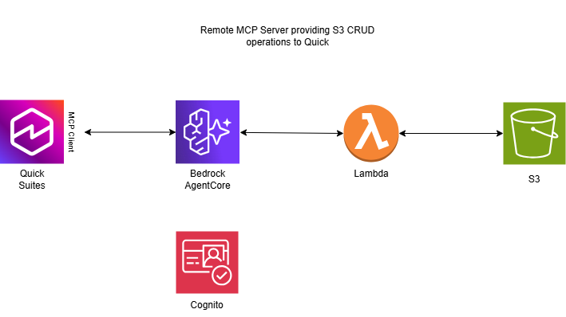

# Bedrock Agent Gateway - S3 CRUD Operations

The genesis of this project was wanting to perform CRUD operations against a S3 bucket from within Quick Suites Flow. Now using this remote MCP server, you can add this to Quick Suites integration, and then call upon the actions from within a Flow.

This is a secure gateway to Amazon Bedrock AgentCore that provides CRUD operations on S3 buckets through a Lambda function. The system uses JWT authentication with Amazon Cognito and exposes MCP (Model Context Protocol) actions for client interactions.


## Description

This project creates a complete infrastructure for secure S3 operations through Amazon Bedrock AgentCore Gateway. It enables applications to perform Create, Read, Update, and Delete operations on S3 objects through a standardized MCP interface with OAuth 2.0 authentication.

### Key Features

- **🔐 Secure Authentication**: OAuth 2.0 client credentials flow with Amazon Cognito
- **📁 Full S3 CRUD Operations**: Create, read, update, delete, and list S3 objects
- **🖼️ Binary File Support**: Handles text files, PDFs, images, and all binary formats
- **🛡️ Security First**: Least privilege IAM policies and encrypted S3 storage
- **🚀 Serverless Architecture**: Lambda-based with automatic scaling
- **📊 Comprehensive Logging**: CloudWatch integration for monitoring and debugging
- **🔧 MCP Protocol**: Standardized Model Context Protocol for AI agent interactions

### Architecture Components

- **Amazon Bedrock AgentCore Gateway**: MCP protocol endpoint
- **AWS Lambda Function**: S3 operations handler with binary file support
- **Amazon S3 Bucket**: Encrypted storage with unique naming
- **Amazon Cognito**: OAuth 2.0 authentication provider
- **IAM Roles**: Least privilege security policies
- **CloudWatch Logs**: Monitoring and debugging




## Installation

### Prerequisites

- AWS CLI configured with appropriate permissions
- AWS account with access to:
  - Amazon Bedrock AgentCore
  - AWS Lambda
  - Amazon S3
  - Amazon Cognito
  - AWS IAM
  - Amazon CloudWatch

### Deployment Steps

1. **Clone the repository**
   ```bash
   git clone <repository-url>
   cd bedrock-agent-gateway
   ```

2. **Deploy the CloudFormation stack**
   ```bash
   aws cloudformation create-stack \
     --stack-name bedrock-agent-gateway \
     --template-body file://template.yaml \
     --capabilities CAPABILITY_NAMED_IAM \
     --region us-west-2
   ```

3. **Monitor deployment progress**
   ```bash
   aws cloudformation wait stack-create-complete \
     --stack-name bedrock-agent-gateway \
     --region us-west-2
   ```

4. **Retrieve deployment outputs**
   ```bash
   aws cloudformation describe-stacks \
     --stack-name bedrock-agent-gateway \
     --region us-west-2 \
     --query "Stacks[0].Outputs"
   ```

### Configuration Parameters

The CloudFormation template accepts the following parameters:

| Parameter | Description | Default | Required |
|-----------|-------------|---------|----------|
| `S3BucketName` | Base name for S3 bucket (made unique with account ID) | `bedrock-gateway-bucket` | No |
| `Environment` | Environment name (dev/staging/prod) | `dev` | No |
| `ProjectName` | Project name for resource naming | `bedrock-agent-gateway` | No |
| `EnableLogging` | Enable CloudWatch logging | `true` | No |
| `TokenExpirationHours` | OAuth token expiration (1-24 hours) | `1` | No |

## Usage

### Authentication

The system uses OAuth 2.0 client credentials flow. After deployment, you'll receive:

- **Gateway Endpoint URL**: The MCP protocol endpoint
- **Client ID**: Cognito User Pool Client ID
- **Client Secret**: Cognito User Pool Client Secret  
- **Token Endpoint**: OAuth 2.0 token endpoint

### Getting an Access Token

```bash
curl -X POST https://your-cognito-domain.auth.region.amazoncognito.com/oauth2/token \
  -H "Content-Type: application/x-www-form-urlencoded" \
  -d "grant_type=client_credentials&client_id=YOUR_CLIENT_ID&client_secret=YOUR_CLIENT_SECRET&scope=bedrock-agent-gateway-dev-api/s3:crud"
```

### MCP Operations

#### 1. Upload a Text File
```json
{
  "key": "documents/readme.txt",
  "content": "Hello, World! This is a text file.",
  "metadata": {
    "author": "user",
    "version": "1.0"
  }
}
```

#### 2. Upload a Binary File (PDF/Image)
```json
{
  "key": "files/document.pdf",
  "content": "JVBERi0xLjQKJcOkw7zDtsO8w7HDqMO6...",
  "is_base64": true,
  "metadata": {
    "type": "document",
    "size": "large"
  }
}
```

#### 3. Read a File
```json
{
  "key": "documents/readme.txt"
}
```

**Response for text files:**
```json
{
  "success": true,
  "content": "Hello, World! This is a text file.",
  "is_base64": false,
  "content_type": "text/plain",
  "content_length": 34
}
```

**Response for binary files:**
```json
{
  "success": true,
  "content": "JVBERi0xLjQKJcOkw7zDtsO8w7HDqMO6...",
  "is_base64": true,
  "content_type": "application/pdf",
  "content_length": 12345
}
```

#### 4. List Files
```json
{
  "prefix": "documents/",
  "max_keys": 10
}
```

#### 5. Delete a File
```json
{
  "key": "documents/readme.txt",
  "confirm": true
}
```

### Supported File Types

- Text Files
- Binary Files (See Quick Suite documentation for supported types)

## Testing

### Unit Tests

Run the Python tests for OAuth functionality:

```bash
python -m pytest tests/ -v
```

### Integration Testing

Test the deployed Lambda function:

```bash
aws lambda invoke \
  --function-name bedrock-dev-s3-ACCOUNT-REGION \
  --payload '{"key": "test.txt", "content": "Hello World"}' \
  --region us-west-2 \
  response.json
```


## Monitoring and Logging

### CloudWatch Log Groups

The system creates three log groups:

- `/aws/lambda/bedrock-ENVIRONMENT-s3-ACCOUNT-REGION` - Lambda function logs
- `/aws/bedrock/PROJECT-ENVIRONMENT-gateway` - Gateway request/response logs  
- `/aws/security/PROJECT-ENVIRONMENT-events` - Security and authentication logs

### Monitoring Commands

```bash
# View Lambda function logs
aws logs tail /aws/lambda/bedrock-dev-s3-ACCOUNT-REGION --follow

# Check gateway metrics
aws cloudwatch get-metric-statistics \
  --namespace AWS/BedrockAgentCore \
  --metric-name Invocations \
  --start-time 2024-01-01T00:00:00Z \
  --end-time 2024-01-02T00:00:00Z \
  --period 3600 \
  --statistics Sum
```

## Security

### IAM Policies

The system implements least privilege access:

- **Lambda Execution Role**: Only access to the specific S3 bucket created by the stack
- **Bedrock Gateway Role**: Only permission to invoke the Lambda function
- **S3 Bucket**: Encrypted at rest, public access blocked, versioning disabled

### Authentication Flow

1. Client requests OAuth token using client credentials
2. Cognito validates credentials and returns JWT access token
3. Client includes JWT token in MCP requests to gateway
4. Gateway validates JWT token against Cognito
5. Authorized requests are forwarded to Lambda function

### Best Practices

- Rotate client secrets regularly
- Use short-lived access tokens (1-24 hours)
- Monitor CloudWatch logs for suspicious activity
- Implement request rate limiting in client applications

## Cleanup

To remove all resources:

```bash
# Empty the S3 bucket first (if it contains objects)
aws s3 rm s3://your-bucket-name --recursive

# Delete the CloudFormation stack
aws cloudformation delete-stack \
  --stack-name bedrock-agent-gateway \
  --region us-west-2

# Wait for deletion to complete
aws cloudformation wait stack-delete-complete \
  --stack-name bedrock-agent-gateway \
  --region us-west-2
```

## Troubleshooting

### Common Issues

1. **Lambda function name too long**
   - Solution: The template automatically generates short, unique names

2. **S3 bucket already exists**
   - Solution: The template creates buckets with unique names using account ID and region

3. **Cognito domain already exists**
   - Solution: Delete existing Cognito domains or use a different project name

4. **Binary file upload fails**
   - Solution: Ensure `is_base64: true` is set for binary content

### Debug Commands

```bash
# Check stack events for errors
aws cloudformation describe-stack-events \
  --stack-name bedrock-agent-gateway \
  --region us-west-2

# Test Lambda function directly
aws lambda invoke \
  --function-name bedrock-dev-s3-ACCOUNT-REGION \
  --payload '{"key": "test.txt"}' \
  --region us-west-2 \
  response.json && cat response.json
```

## Contributing

1. Fork the repository
2. Create a feature branch (`git checkout -b feature/amazing-feature`)
3. Commit your changes (`git commit -m 'Add amazing feature'`)
4. Push to the branch (`git push origin feature/amazing-feature`)
5. Open a Pull Request

### Development Setup

```bash
# Install development dependencies
pip install -r requirements.txt

# Run tests
python -m pytest tests/ -v

# Validate CloudFormation template
aws cloudformation validate-template --template-body file://template.yaml
```

## License

This project is licensed under the MIT License - see the [LICENSE](LICENSE) file for details.

## Authors and Acknowledgment

- **Primary Developer**: David Girling
- **AWS Services**: Amazon Bedrock AgentCore, AWS Lambda, Amazon S3, Amazon Cognito
- **Protocol**: Model Context Protocol (MCP) specification

