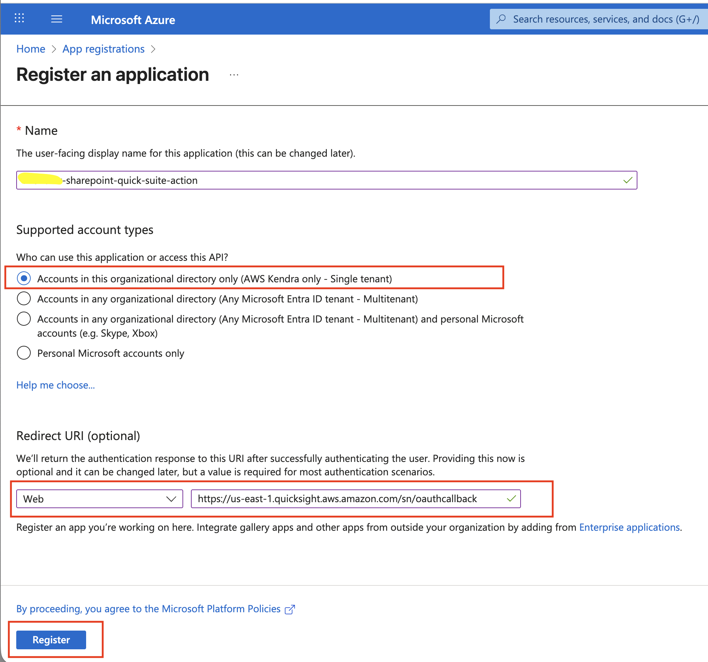
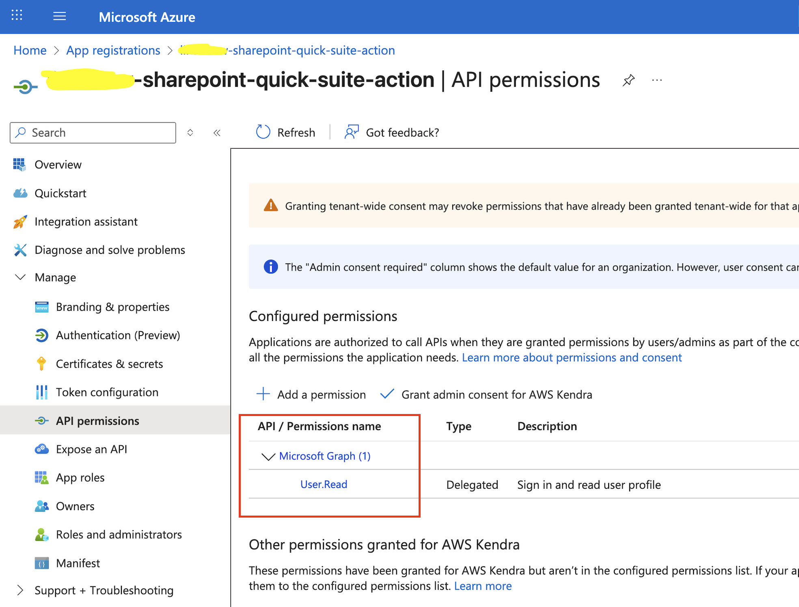
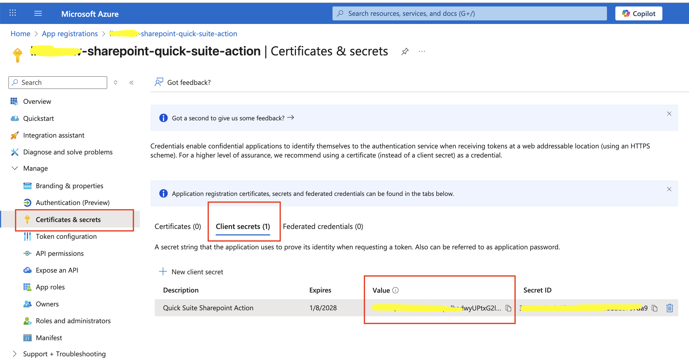
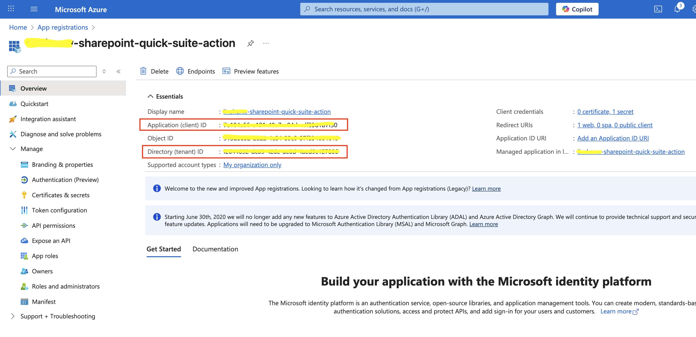
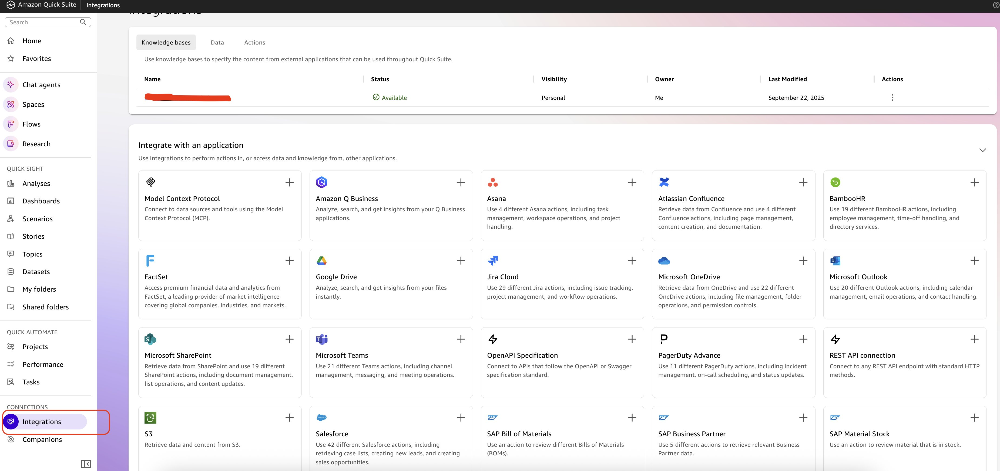
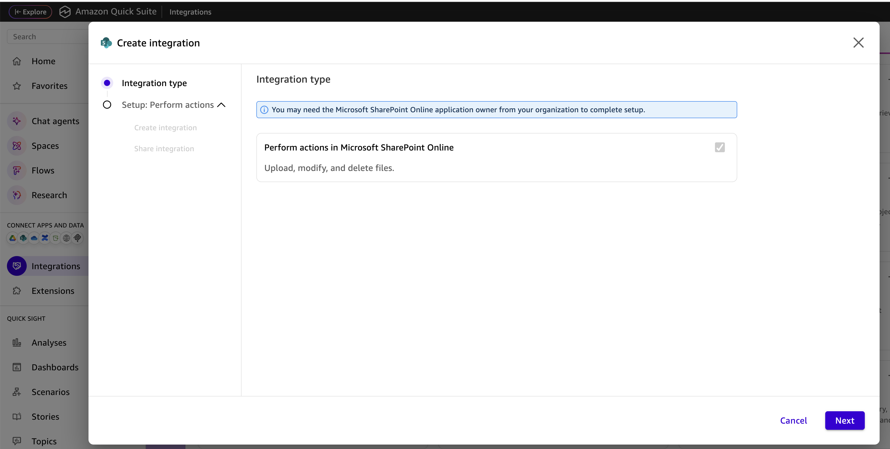
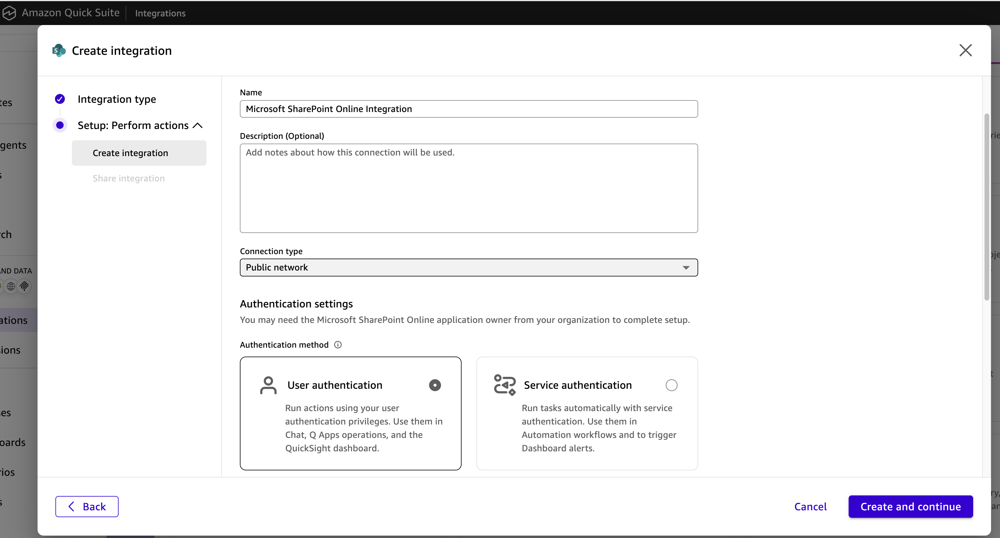
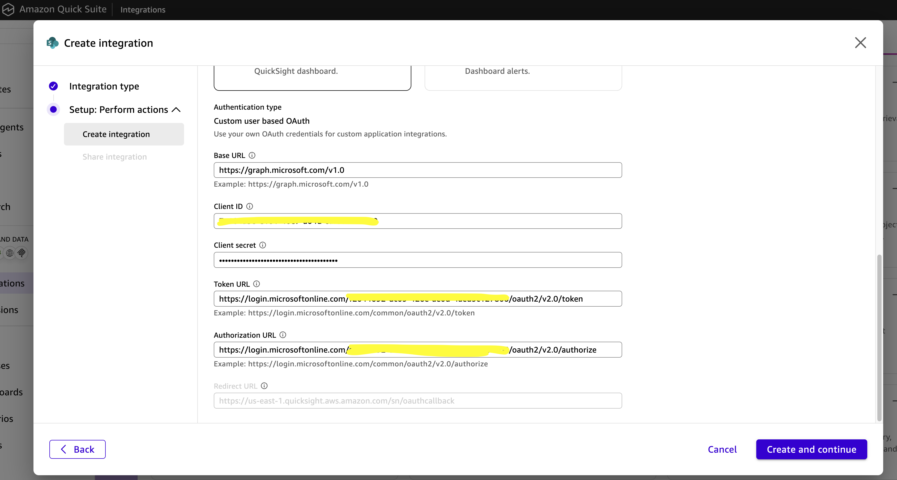
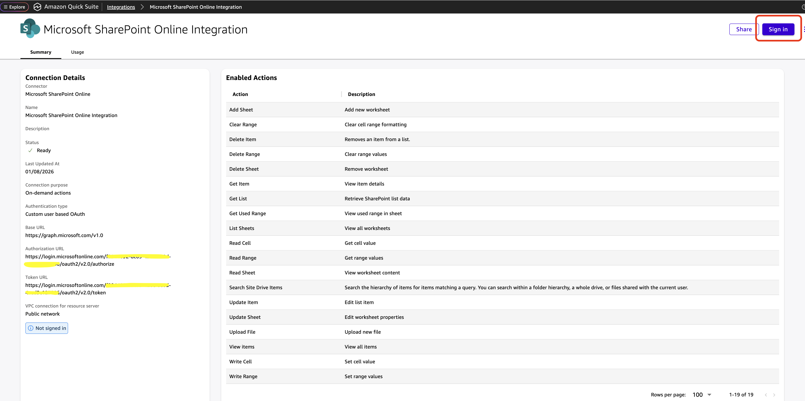
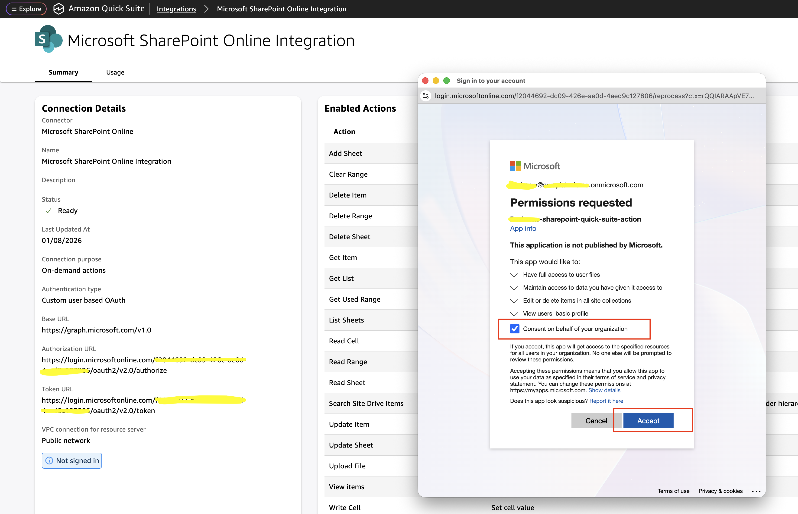

# MS Sharepoint - Action Setup Guide

1. Sign in to the Microsoft Entra admin center as at least an Application Developer.

2. Browse to **Entra ID** => **App registrations** and select **New registration**

   Choose **Single tenant** and provide optional `Web` Redirect URI: `https://us-east-1.quicksight.aws.amazon.com/sn/oauthcallback`

   Click **Register** button:

3. Navigate to this app registration => **API permissions** => **Add a permission** => **Microsoft Graph API**:

   **Note**: Leave the pre-selected `User.Read` under **Microsoft Graph**.

4. From **Certificates & secrets** => **Client secrets** => **+ New client secret**, copy client secret value

   (**Note**: only copy the secret **Value**, NOT the Secret ID)

5. Also copy the **Client ID** and **Tenant ID** from there:

6. Go to **AWS** > **Quick Suite** page, and click on **Integration**:

7. Select **Microsoft SharePoint Online Integration** then **Next**

   **Connection Type**: Choose `Public network` or Your own VPC

   **Base URL**: `https://graph.microsoft.com/v1.0`

   **Client ID**: (copy the value from step 5)

   **Client secret**: (copy the value from step 4)

   **Token URL**: `https://login.microsoftonline.com/{your_tenant_id}/oauth2/v2.0/token`

   **Authorization URL** (Not needed for **Service authentication**):
   `https://login.microsoftonline.com/{your_tenant_id}/oauth2/v2.0/authorize`

   **Redirect URL** (Not needed for **Service authentication**):
   `https://us-east-1.quicksight.aws.amazon.com/sn/oauthcallback`

   **Note**: `{your_tenant_id}` is copied from step 5).

8. Click on **Create and continue**

9. Navigate to **Integration** => **Actions** => **Microsoft SharePoint Online Integration** (or your MS Sharepoint integration name), and click on **Sign in**:

10. Check **Consent on behalf of your organization** and click **Accept**:

11. Enter your Microsoft Sharepoint email and password in the popup window

12. In Quick Suite, while creating chat agent, you can now link this action to the chat agent.
