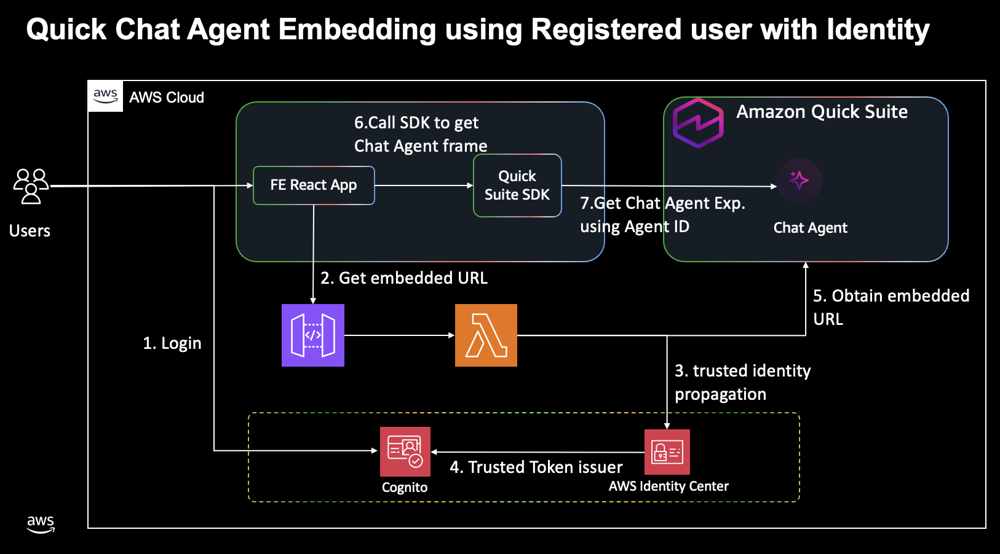

# Quick Chat Agent Embedding Demo

Bring AI-powered conversational intelligence directly into your applications with Amazon QuickSuite embedded chat. This demo shows how to seamlessly integrate QuickSuite's unified chat experience—which combines structured data insights, document knowledge, and actionable workflows into your own web applications.

This implementation uses the `generate_embed_url_for_registered_user_with_identity` API to create secure, user specific embed URLs with trusted identity propagation, ensuring authenticated users receive personalized chat experiences within your application.

## 🎯 Business Value

- Embed Amazon QuickSuite chat agents into existing web applications
- Maintain security with trusted identity propagation
- Scale chat functionality across multiple domains and applications
- Leverage AWS managed services for reliability and performance

## 🎯 Demo


## 🏗️ Architecture



## 🎯 Overview

Complete embedding solution with:

- **Next.js Frontend** with responsive chat interface
- **Amazon Cognito Authentication** for secure user management
- **AWS Lambda Functions** for embedding URL generation
- **AWS CDK Infrastructure** for automated deployment
- **Session Management** with 10-hour token lifetime

## 📁 Project Structure

```
├── infrastructure/          # AWS CDK deployment code
│   ├── cdk-app.ts          # Main CDK application
│   ├── cloudformation.yaml # CloudFormation template
│   └── deploy.sh           # Deployment script
└── fe/                     # Next.js frontend application
    ├── app/                # Next.js app router
    ├── components/         # React components
    └── lib/                # Utility functions
```

## 🚀 Getting Started

### 1. Clone Repository (Sparse Checkout)

```bash
# Clone repository with sparse checkout
git clone --filter=blob:none --sparse https://github.com/aws-samples/sample-amazon-quick-suite-knowledge-hub.git
cd sample-amazon-quick-suite-knowledge-hub

# Configure sparse checkout for this use case only
git sparse-checkout set docs/use-cases/quick-chat-agent-embedding-demo
```

### 2. Deploy Infrastructure

For local development with default domain configuration:

```bash
cd infrastructure
./deploy.sh 'http://localhost:3000,https://yourdomain.com'
```

For detailed deployment instructions and options, see the `infrastructure/README.md` file.

### 3. Create Users

Before starting the frontend application, you must create matching users in both Amazon Cognito and AWS IAM Identity Center using the same email address.

#### Create Amazon Cognito User

1. Navigate to the AWS Console → Amazon Cognito
2. Go to **User pools** → Select your user pool
3. Go to **Users** → **Create user**
4. Enter your email address and set a password
5. Complete the user creation process

#### Create AWS IAM Identity Center User

1. Navigate to the AWS Console → AWS IAM Identity Center
2. Go to **Users** → **Add User**
3. Use the exact same email address as the Amazon Cognito user
4. Complete the user creation process

#### Why Both Users Are Required

- **Amazon Cognito User**: Authenticates the web application
- **AWS IAM Identity Center User**: Required for Amazon QuickSuite trusted identity propagation
- **Matching Email Addresses**: Links the identities for seamless authentication flow

**Important**: The email addresses must match exactly for trusted identity propagation to function correctly.

### 4. Configure Amazon QuickSuite Agent ID

1. Navigate to the Amazon QuickSuite console
2. Go to **Explore** → **Chat agents**
3. In the **Action** column, select the options menu next to **Chat**
4. Choose **View chat agent details**
5. Select **Copy link** next to the chat agent name
6. Extract the agent ID from the URL:

   ```
   https://us-east-1.quicksight.aws.amazon.com/sn/start/agents?view=6fxxxxxx-xxxx-xxxx-xxxx-xxxxxx43137d
   ```

7. The value after `view=` is your agent ID
8. Update the `.env.local` file in the `fe/` directory:

   ```
   NEXT_PUBLIC_QUICKSUITE_AGENT_ID=your-agent-id-here
   ```

**Important**: Replace `REPLACE_WITH_YOUR_AGENT_ID` in the `.env.local` file with your actual agent ID before starting the frontend application.

### 5. Start the Frontend Application

```bash
cd fe
npm install
npm run dev
```

Access the application at `http://localhost:3000`

## Cleanup

```bash
cd infrastructure
cdk destroy
```

## License

This project is licensed under the MIT No Attribution License - see the [LICENSE](LICENSE) file for details.
